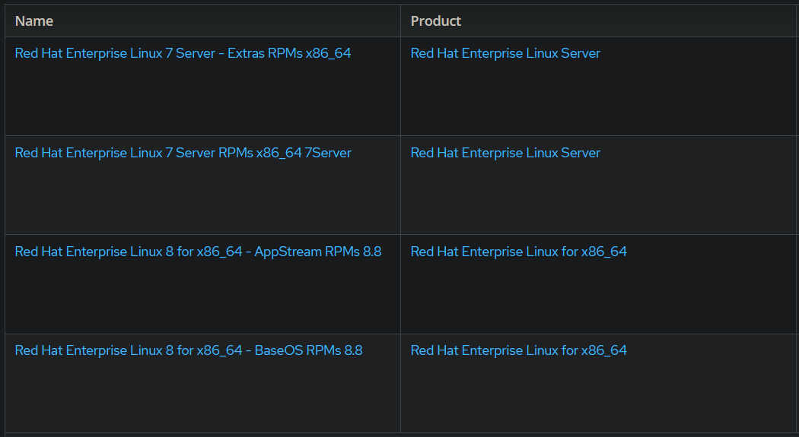

Dans cet article, nous allons voir comment mettre à jour grâce à l'outil "leapp", un serveur RHEL géré par Red Hat Satellite de la version 7 à la 8. Dans cet exemple, la version cible sera la 8.8.



Veillez à prendre des mesures de précautions avant toutes tentatives de mise à jour de vos serveurs : sauvegarde des données, snapshots...


## 1. Configuration de la Content View
Dans un premier temps, sur votre serveur Red Hat Satellite, il est nécessaire de créer une "Content View" spécialement dédiée à l'upgrade. Celle-ci doit contenir les repositories suivants :



Il est possible d'upgrader le système vers la version 8.6 plutôt que la 8.8. Il suffit de remplacer les 2 repositories de la version 8.8 par ceux de la 8.6.


Une fois la publication de cette Content View effectuée, on la promeut vers l'environnement de notre serveur puis on lui assigne.<br/>
Pour que ce changement de Content View soit pris en compte sur la machine que l'on veut upgrade, on exécute :

```Shell
subscription-manager refresh
```

## 2. Upgrade jusqu'à RHEL 7.9
La prochaine étape consiste à monter la version de notre serveur actuellement sous RHEL 7.X vers la 7.9. On s'assure d'abord que les repos fournis par notre nouvelle Content View sont bien activés :

```Shell
subscription-manager repos --enable *
```

On lance alors la mise à jour du système :
```Shell
yum update
```
Un redémarrage du serveur sera alors nécessaire. On s'assure ensuite que nous avons bien atteint la version 7.9 :

```Shell
cat /etc/redhat-release
```

## 3. Preupgrade

Nous allons maintenant utiliser l'outil de Red Hat : "leapp", qui permet d'effectuer des mises à jour de versions majeures. Il faut évidemment l'installer :
```Shell
yum install leapp -y
```

Une fois installé, nous lançons la commande :
```Shell
leapp preupgrade --target 8.8
```
<p>Cette commande va en fait vérifier la faisabilité de l'upgrade en analysant un certain nombre de prérequis sur la machine. Elle nous dira si oui ou non l'upgrade est possible. Le tout sera généré sous la forme d'un rapport contenant le détail des problèmes que va potentiellement poser la mise à jour. Ceux-ci peuvent être variés et seront classés selon leur facteur de risque. Certains seront négligeables tandis que d'autres empêcherons carrément la mise à jour. Ces derniers auront alors un facteur de risque "Inhibitor".</p>
<p>Cette étape qui consiste à régler tous les problèmes relevés par la commande "leapp preupgrade" diffèrera selon chaque machine. Il convient donc ici de revoir en détails chacun d'entre eux et de décider s'ils doivent être corrigés ou non. Tâche obligatoire pour les problèmes à facteur de risque "Inhibitor". Des solutions ou au moins une piste de résolution seront proposées dans ce même rapport.</p>
Voici quelques exemples de problèmes inhibiteurs que j'ai pu rencontrer. Ce n'est pas une liste exhaustive mais cela pourra peut-être vous aider :

* `Possible problems with remote login using root account` : Une lacune dans la configuration SSH de la machine. La directive "PermitRootLogin" doit être déclarée explicitement pour corriger ce problème.

* `Leapp detected loaded kernel drivers which have been removed in RHEL 8. Upgrade cannot proceed.` : Certains modules du kernel doivent être retirés. Il est possible de le faire avec la commande : `rmmod <nom_du_module>`

* `Multiple devel kernels installed` : Plusieurs versions du kernel sont présents sur la machine. Un seul doit subsister pour continuer. Ici, la commande est normalement fournie dans le rapport.

* `Missing required answers in the answer file` : Ici aussi, la commande à exécuter pour régler ce point est fournie dans le rapport.

## 4. Upgrade

Après avoir résolu ou au moins pris connaissance de tous les risques identifiés par leapp dans le rapport pre-upgrade, nous pouvons passer à l'upgrade vers la version 8 : 

```Shell
leapp upgrade --target 8.8
```

Une fois la commande terminée sans erreur, il ne restera plus qu'à reboot le système : celui-ci tourne maintenant sous RHEL 8.8 !